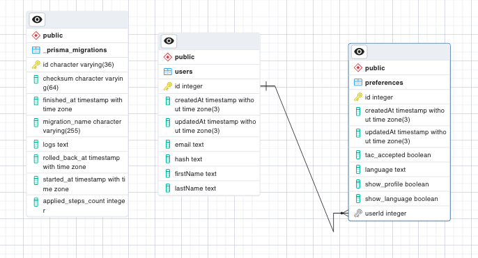

# Getting started

## Installation

```bash
$ npm install
```

## Running the app

```bash
# development
$ npm run start

# watch mode
$ npm run start:dev

# production mode
$ npm run start:prod
```

## Test

```bash
# unit tests (jest)
$ npm run test


# api tests (guerkin/cucumber/pactum)
$ npm run cucumber
```

## Configuration

```bash
Environment variables must be configured in project setup. Required variables can be found in file .env.template.
```

## Dependencies

```bash
Using different versions of dependencies may cause conflicts. Dependencies, development dependencies and the versions used here can be found in file package.json.
```

# Project Overview

## Objective

```bash

"As a User, I want to be able to save my user profile setting via API so that I can easily control my preferences via API in the future"
```

## Functionality (API endpoint)

```bash
According to the above business need, an endpoint (POST Api) has been developed to save the following user preferences:

- Terms and Conditions accepted (true/false)
- Language preferences (saved as string)
- Show profile preference - show or not show (true/false)
- Show language preference - show or not show (true/false)

Additional: user authorisation (sign up and sign in) end points.

Data is saved against a unique user ID (per user registration above) and only one set of preferences (one POST to endpoint) can be saved per user, with duplicate calls rejected (a PUT request would need to be implemented to handle preference changes)

Preferences endpoint is protected with user token - the API call must contain a valid token in header in order for call to be successful.

This endpoint and documentation for API can be found here: https://documenter.getpostman.com/view/26092520/2s93z9aMMM

The base url of the deployed endpoint is: https://user-endpoint.onrender.com

Inputs are validated, accepted data types model can be seen in file Prisma>Schema.Prisma.
```

## Database

```bash
Data is stored using an ORM (Postgres using Prisma). A SQL database is used in order to be able to relate user data with their preferences data.

The following diagram demonstrates the data tables used in this project and the relationship between each:
```



## Testing

```bash
Jest was used to unit test the preferences endpoint. Cucumber and Pactum were used, using gherking, to provide initial API testing (testing for additional scenarios to be implemented)
```
